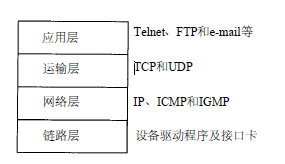
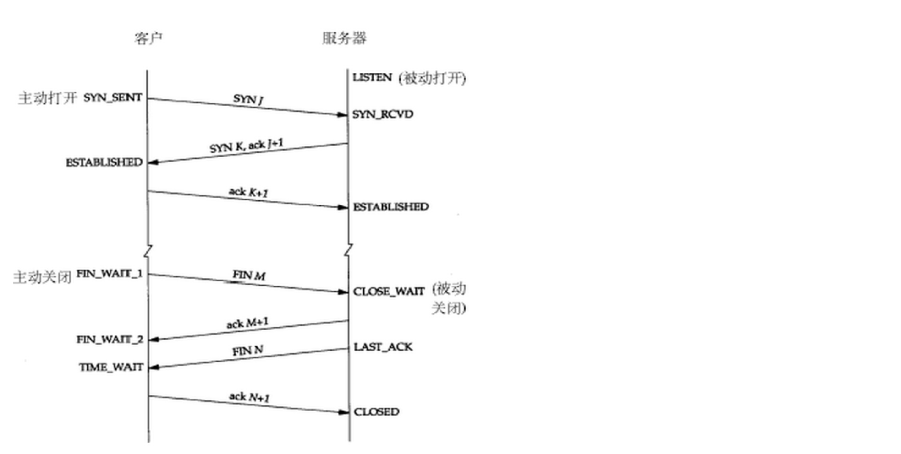
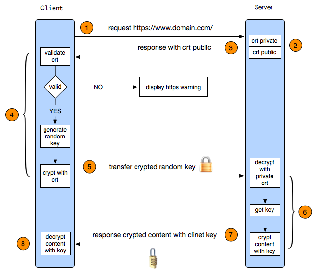

# 通信协议
## 说一下 TCP/IP 四层

自上而下可以分为以下四层：

* `应用层`：负责处理特定的应用程序细节
* `运输层`：主要为两台主机上的应用提供端到端的通信。
* `网络层（互联网层）`：处理分组在网络中的活动，比如分组的选路。
* `链路层（数据链路层/网络接口层）`：包括操作系统中的设备驱动程序、计算机中对应的网络接口卡

## http 的工作流程？http 1.0、http 1.1、http 2.0 具体哪些区别啊？

Http 的工作流程
* HTTP 连接使用的是`“请求—响应”的方式`，不仅在请求时需要先建立连接，而且需要客户端向服务器发出请求后，服务器端才能回复数据；
* 客户端发送一个请求时，开始建立连接，收到响应之后，关闭连接；
* 请求和响应内容包括 Header 和 Body；
* Http 不同的版本就是在针对请求-响应的工作流程做优化，比如`长连接`、`多路复用`、`服务端推送`；

Http 1.0 
* 超文本传输协议，原本只用来传输 HTML，后来 Web 端不断发展，产生了各种多媒体内容，包括 js、css、img 等各种文件；

Http 1.1
* HTTP 1.1通过增加`更多的请求头和响应头`来改进和扩充HTTP 1.0的功能;
* `长连接` - 通过添加 Connection 字段来进行长连接的实现；
* `缓存管理` - 支持新的缓存管理的头部字段；
* `100(Continue) Status(节约带宽)` - 客户端事先发送一个只带头域的请求；
* `Host` - 支持虚拟主机；

Http 2.0
* 在完全支持 HTTP 1.x 语意的基础上，`极大的提升性能`
* `多路复用`：许同时通过`单一的 HTTP/2 连接发起多重的请求-响应`消息
* `服务端推送`：服务端推送是一种在客户端请求之前发送数据的机制。在 HTTP/2 中，服务器可以对客户端的一个请求发送多个响应。`可用于做前端性能优化`。
* `二进制 Frame`：HTTP/2在 应用层(HTTP/2)和传输层(TCP or UDP)之间增加一个`二进制分帧层`；
* `首部压缩`：HTTP/1.1并不支持 HTTP 首部压缩，为此 SPDY 和 HTTP/2 应运而生；

## TCP 三次握手，四层分手的工作流程？画一下流程图？为什么不是四次、五次或者二次啊？
* `客户端 TCP 状态迁移`：CLOSED->SYN_SENT->ESTABLISHED->FIN_WAIT_1->FIN_WAIT_2->TIME_WAIT->CLOSED
* `服务器 TCP 状态迁移`：CLOSED->LISTEN->SYN收到->ESTABLISHED->CLOSE_WAIT->LAST_ACK->CLOSED

为什么是三次握手呢？
* 第一次和第二次，`一个 SYN、一个 ACK，双方就对客户端的序列号达成了一致`，客户端进入 Established 状态；
* 第二次和第三次，`对服务端的序列号达成了一致`，服务端进入 Established 状态;

TCP 四次挥手
* TCP 三次握手中，服务端可以`把ACK和SYN（ACK起应答作用，而SYN起同步作用）放在一个报文里来发送`
* TCP 四次挥手中，由于TCP连接是全双工的，因此`每个方向都必须单独进行关闭`
* 关闭连接时，当收到对方的FIN报文通知时，它`仅仅表示对方没有数据发送给你了；但未必你所有的数据都全部发送给对方了`，所以你可以未必会马上会关闭SOCKET,也即你`可能还需要发送一些数据给对方之后，再发送FIN报文`给对方来表示你同意现在可以关闭连接了，所以它这里的ACK报文和FIN报文多数情况下都是分开发送的。

## 画一下 https 的工作流程？具体如何实现啊？如何防止被抓包啊？
下图为 https 工作流程

中间人攻击：

* 对 https 进行攻击主要采用`中间人攻击`；
* 第一步， fiddler 向服务器发送请求进行握手， 获取到服务器的CA证书， 用根证书公钥进行解密， 验证服务器数据签名，获取到服务器CA证书公钥。 
* 第二步， fiddler 伪造自己的CA证书， 冒充服务器证书传递给客户端浏览器，客户端浏览器做跟fiddler一样的事。 
* 第三步， 客户端浏览器生成https通信用的对称密钥，用fiddler伪造的证书公钥加密后传递给服务器， 被fiddler截获。 
* 第四步， fiddler 将截获的密文用自己伪造证书的私钥解开，获得https通信用的对称密钥。 
* 第五步， fiddler将对称密钥用服务器证书公钥加密传递给服务器， 服务器用私钥解开后建立信任，握手完成， 用对称密钥加密消息， 开始通信。 
* 第六步， fiddler接收到服务器发送的密文， 用对称密钥解开，获得服务器发送的明文。再次加密， 发送给客户端浏览器。 
* 第七步， 客户端向服务器发送消息， 用对称密钥加密， 被fidller截获后，解密获得明文。 

由于fiddler一直拥有通信用对称密钥， 所以在整个https通信过程中信息对其透明。也就是说`fiddler&charles向服务器冒充是客户端，向客户端又谎称自己是服务器`。

使用双向加密，避免中间人攻击：

引用
* [@HTTP Wikipedia](https://en.wikipedia.org/wiki/Hypertext_Transfer_Protocol)
* [@HTTP 2 相对于 HTTP 1 的重大改进](https://www.zhihu.com/question/34074946)
* [@面试时如何优雅的谈论HTTP／1.0／1.1／2.0](https://www.jianshu.com/p/52d86558ca57)
* [@Https 单向认证和双向认证](http://blog.csdn.net/duanbokan/article/details/50847612)
