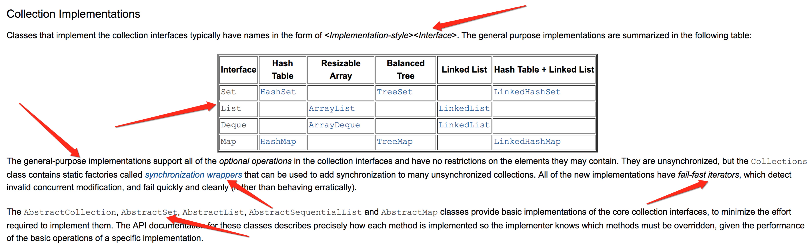
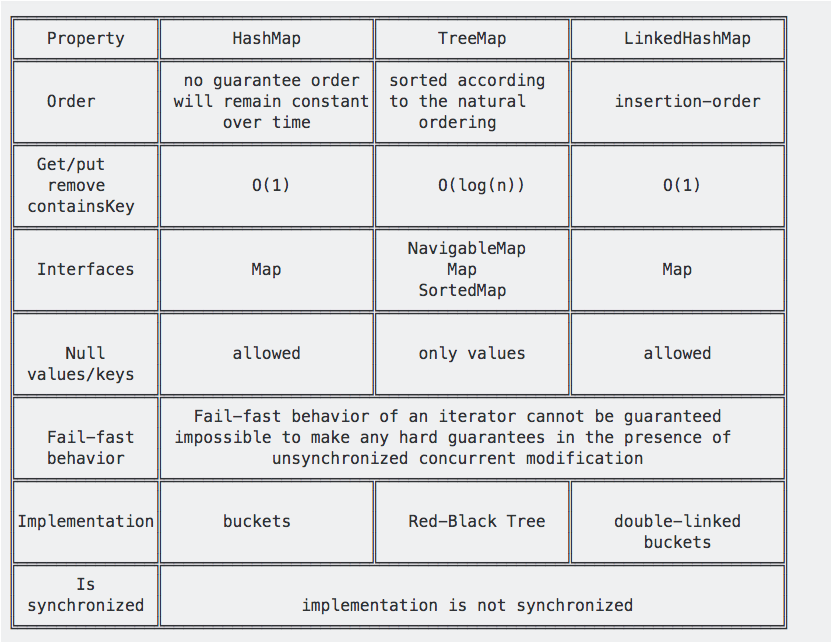
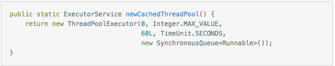
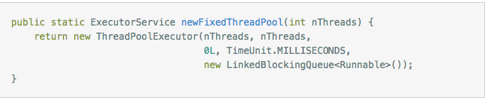
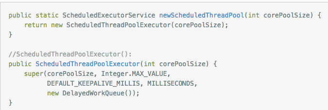
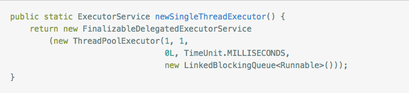

## CoreJava

### hashcode 相等两个类一定相等吗？equals 呢？相反呢？
* hashcode 相等不代表两个类相等；equals 相等代表类的实现者实现了 equals 并且设定了 equals 相等的逻辑，所以是相等的。
* 相反，两个类相等，则 equals 肯定相等，hashcode 也一定相等；（这里的相等是指的物理上的含义）

### 介绍一下集合框架
集合框架是`一组用来代表和操作集合的架构`，包括相应的：
* `接口`
* `实现`
* `算法`

主要的好处包括：
* 降低了成本：
  * `学习使用新 API` - 基于统一的接口，容易掌握
  * `设计新 API` - 直接使用现有 collection 接口
  * `编程成本` - 写代码直接使用，方便快捷
* 增加了
  * `速度和质量` - 集合框架都已经高质量的实现，可直接使用
  * `互操作性` - 新写的库与其他库，只要遵循标准接口，就可以无缝互操作
  * `代码重用性`

[optional] 将集合框架拆的更细一点的话，包括的内容有：

* `Collection interfaces`               - Represent different types of collections, such as sets, lists, and maps. These interfaces form the basis of the framework.
* `General-purpose implementations`     - Primary implementations of the collection interfaces.
* `Legacy implementations`              - The collection classes from earlier releases, Vector and Hashtable, were retrofitted to implement the collection interfaces.
* `Special-purpose implementations`     - Implementations designed for use in special situations. These implementations display nonstandard performance * characteristics, usage restrictions, or behavior.
* `Concurrent implementations`          - Implementations designed for highly concurrent use.
* `Wrapper implementations`             - Add functionality, such as synchronization, to other implementations.
* `Convenience implementations`         - High-performance "mini-implementations" of the collection interfaces.
* `Abstract implementations`            - Partial implementations of the collection interfaces to facilitate custom implementations.
* `Algorithms`                          - Static methods that perform useful functions on collections, such as sorting a list.
* `Infrastructure`                      - Interfaces that provide essential support for the collection interfaces.
* `Array Utilities`                     - Utility functions for arrays of primitive types and reference objects. Not, strictly speaking, a part of the collections framework, this feature was added to the Java platform at the same time as the collections framework and relies on some of the same infrastructure.

集合接口包括：

The most basic interface, 

`java.util.Collection`, has the following descendants:
* java.util.Set
* java.util.SortedSet
* java.util.NavigableSet
* java.util.Queue
* java.util.concurrent.BlockingQueue
* java.util.concurrent.TransferQueue
* java.util.Deque
* java.util.concurrent.BlockingDeque

`java.util.Map` has the following offspring:
* java.util.SortedMap
* java.util.NavigableMap
* java.util.concurrent.ConcurrentMap
* java.util.concurrent.ConcurrentNavigableMap

在实现接口时候，仍`考虑以下的维度`：

* `Mutability` - Collection is mutable or immutable
* `Modifiability` - 子类在实现的时候，有些修改操作如果不实现可以直接抛出 UnsupportedOperationException
* `Resizability` - List is fixed-size or varaible-size
* `Access Method` - List is sequential access or random access
* `Element Restriction` - 
  * Be of particular type
  * Be not null
  * Obey some arbitrary predicate

接口的实现

并发编程中接口实现为：

* `BlockingQueue`
* `TransferQueue`
* `BlockingDeque`
* `ConcurrentMap`
* `ConcurrentNavigableMap`

相关的实现为：

* `LinkedBlockingQueue`
* `ArrayBlockingQueue`
* `PriorityBlockingQueue`
* `DelayQueue`
* `SynchronousQueue`
* `LinkedBlockingDeque`
* `LinkedTransferQueue`
* `CopyOnWriteArrayList`
* `CopyOnWriteArraySet`
* `ConcurrentSkipListSet`
* `ConcurrentHashMap`
* `ConcurrentSkipListMap`

设计目标：

* 【后续补充】

## Hashmap 和 Hashtable 有什么区别？ Hashtable vs SynchronizedMap vs ConcurrentHashMap ?

### Hashmap 和 Hashtable 有什么区别？
* `Hashtable is synchronized, whereas HashMap is not`
* `Hashtable does not allow null keys or values`.  `HashMap allows one null key and any number of null values.`
* One of HashMap's subclasses is LinkedHashMap, so in the event that you'd want predictable iteration order.

`I'd recommend HashMap`. If synchronization becomes an issue, `you may also look at ConcurrentHashMap`.

### Hashtable vs SynchronizedMap vs ConcurrentHashMap

#### SynchronizedMap
* `Synchronization at Object level`.
* Every `read/write operation needs to acquire lock`.
* This essentially gives access to `only one thread to the entire map` & `blocks all the other threads`.
* SynchronizedHashMap returns Iterator, which fails-fast on concurrent modification.

#### ConcurrentHashMap
* `High concurrency`.
* It is `thread safe without synchronizing the whole map`.
* Reads can happen very fast while `write is done with a lock`.
* There is `no locking at the object level`, but at a `hashmap bucket level`.
* ConcurrentHashMap uses `multitude of locks`.

## HashMap vs TreeMap vs LinkedHashMap
都实现了 `Map` 接口，并提供相同的功能。唯一不同的遍历的顺序：
* `HashMap` makes absolutely `no guarantees about the iteration order`.
* `TreeMap` will iterate `according to the "natural ordering" using compareTo() or SortedMap`
* `LinkedHashMap` will iterate in the order in which the entries were put into the map

## 线程池用过吗？都有什么参数？底层如何实现的？
### 为什么需要线程池？

* 创建/销毁线程伴随着系统开销，`过于频繁的创建/销毁线程，会很大程度上影响处理效率`
* 线程`并发数量过多，抢占系统资源`从而导致阻塞
* 对线程进行`一些简单的管理`

### Java 中的线程池实现是 `ThreadPoolExecutor 类`，参数构成：
* `int corePoolSize` => 该线程池中`核心线程数最大值`;
  * 核心线程 - 默认情况下一直存活的线程池
  * 非核心线程 - 不用了就销毁
* `int maximumPoolSize` => `线程总数最大值`
* `long keepAliveTime` => 非核心线程闲置超时时长
* `TimeUnit unit` => keepAliveTime的单位，TimeUnit是一个枚举类型
* `BlockingQueue<Runnable> workQueue` => 常用的 workQueue 类型：

  * `SynchronousQueue`：这个队列接收到任务的时候，会直接提交给线程处理，而不保留它，如果所有线程都在工作怎么办？那就新建一个线程来处理这个任务！所以为了保证不出现<线程数达到了maximumPoolSize而不能新建线程>的错误，使用这个类型队列的时候，maximumPoolSize一般指定成Integer.MAX_VALUE，即无限大

  * `LinkedBlockingQueue`：这个队列接收到任务的时候，如果当前线程数小于核心线程数，则新建线程(核心线程)处理任务；如果当前线程数等于核心线程数，则进入队列等待。由于这个队列没有最大值限制，即所有超过核心线程数的任务都将被添加到队列中，这也就导致了maximumPoolSize的设定失效，因为总线程数永远不会超过corePoolSize

  * `ArrayBlockingQueue`：可以限定队列的长度，接收到任务的时候，如果没有达到corePoolSize的值，则新建线程(核心线程)执行任务，如果达到了，则入队等候，如果队列已满，则新建线程(非核心线程)执行任务，又如果总线程数到了maximumPoolSize，并且队列也满了，则发生错误

  * `DelayQueue`：队列内元素必须实现Delayed接口，这就意味着你传进去的任务必须先实现Delayed接口。这个队列接收到任务时，首先先入队，只有达到了指定的延时时间，才会执行任务

### 常见四种线程池，使用 `ThreadPoolExecutor 的不同配置来生成`：

* `CachedThreadPool` - 线程数无限制

* `FixedThreadPool` - 可控制线程最大并发数，超出的线程会在队列中等待

* `ScheduledThreadPool` - 支持`定时及周期性执行`

* `SingleThreadExecutor` - `有且仅有一个工作线程执行任务`，任务执行顺序 FIFO

引用

* [@Java 集合框架](https://docs.oracle.com/javase/8/docs/technotes/guides/collections/overview.html)
* [@Java 8 Collection Tutorials](https://docs.oracle.com/javase/tutorial/collections/index.html)
* [@Java 线程池](https://www.jianshu.com/p/210eab345423)
