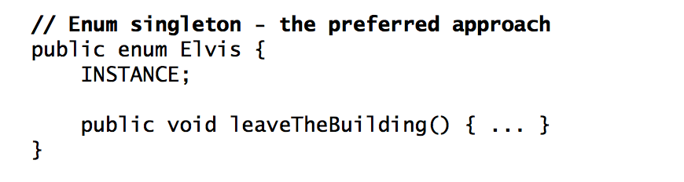
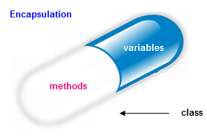
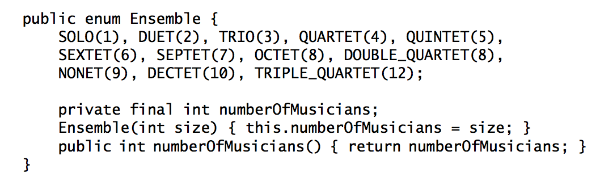
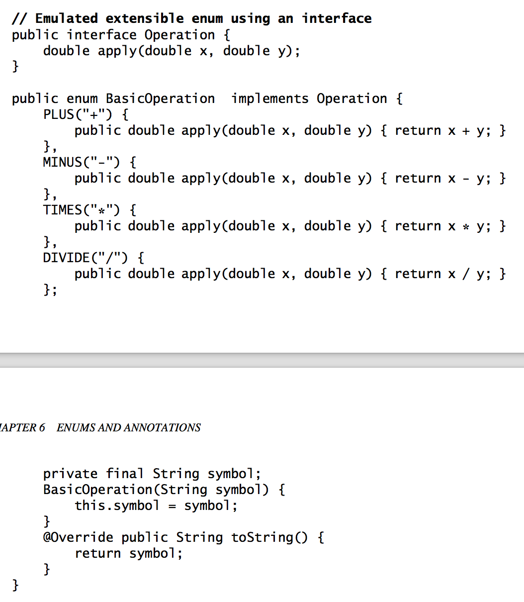

## Effective Java, 2nd Edition

by Joshua Bloch

*I, [Michael Parker](http://omgitsmgp.com/), own this book and took these notes to further my own learning. If you enjoy these notes, please [purchase the book](http://www.amazon.com/Effective-Java-Edition-Joshua-Bloch/dp/0321356683)!*

### Creating and Destroying Objects
#### Item 1: Consider static factory methods instead of constructors

`static factory methods advantages` is that, unlike constructors, 
* `they have names`
* `not required to create a new object` each time
* can `return an object of any subtype` of their return type

`The main disadvantage` of providing only static factory methods is 
* classes without public or protected constructors `cannot be subclassed`
* are `not readily distinguishable from other static methods`

#### Item 2: Consider a builder when faced with many constructor parameters
* `The telescoping constructor pattern works`, but it is `hard to write client code when there are many parameters`, and harder still to read it
* `A JavaBean may be in an inconsistent state` partway through its construction
* The JavaBeans pattern precludes the possibility of making a class immutable
* `The Builder pattern simulates named optional parameters`
* Class.newInstance breaks compile-time exception checking
* The Builder pattern is a good choice when designing classes whose constructors or static factories would have more than a handful of parameters

#### Item 3: Enforce the singleton property with a private constructor or an enum type
* Making a class a singleton can make it difficult to test its clients;
* `A single-element enum type` is the best way to implement a singleton;

#### Item 4: Enforce noninstantiability with a private constructor
* Attempting to enforce noninstantiability by making a class abstract does not work
* A class can be made `noninstantiable by including a private constructor`

#### Item 5: Avoid creating unnecessary objects
#### Item 6: Eliminate obsolete object references
* Nulling out object references should be the exception rather than the norm
* Whenever a class manages its own memory, the programmer should be alert for memory leaks
* Another common source of `memory leaks is caches`
* A third common source of `memory leaks is listeners and other callbacks`

#### Item 7: Avoid finalizers（？？？）
* Finalizers are unpredictable, often dangerous, and generally unnecessary.
* Never do anything time-critical in a finalizer
* Never depend on a finalizer to update critical persistent state
* There is a severe performance penalty for using finalizers
* Provide an explicit termination method
* Explicit termination methods are typically used in combination with the try-finally construct to ensure termination
* The finalizer should log a warning if it finds that the resource has not been terminated

### Methods common to all objects

#### Item 8: Obey the general contract when overriding equals
* The `easiest way to avoid problems is not to override the equals method`, in which case `each instance of the class is equal only to itself`. This is the right thing to do if any of the following conditions apply:
  1. Each instance of the class is inherently unique
  2. You don’t care whether the class provides a “logical equality” test
  3. A superclass has already overridden equals , and the superclass behavior is appropriate for this class
  4. The class is private or package-private, and you are certain that its equals method will never be invoked

#### Item 9: `Always override hashCode when you override equals`
* The key provision that is violated when you fail to override hashCode is the second one: `equal objects must have equal hash codes`
* Do not be tempted to exclude significant parts of an object from the hash code computation to improve performance

#### Item 10: Always override toString
* Providing a `good toString implementation makes your class much more pleasant to use`
* When practical, the toString method should return all of the interesting information contained in the object
* Whether or not you decide to specify the format, you should clearly document your intentions
* Provide programmatic access to all of the information contained in the value returned by toString

#### Item 11: Override clone judiciously（？？？）
* If you override the clone method in a nonfinal class, you should return an object obtained by invoking super.clone
* In practice, a class that implements Cloneable is expected to provide a properly functioning public clone method
* Never make the client do anything the library can do for the client
* In effect, the clone method functions as another constructor; you must ensure that it does no harm to the original object and that it properly establishes invariants on the clone
* The clone architecture is incompatible with normal use of final fields referring to mutable objects
* You are better off providing an alternative means of object copying, or simply not providing the capability
* A fine approach to object copying is to provide a copy constructor or copy factory

#### Item 12: Consider implementing Comparable
By `implementing Comparable` , a class `indicates that its instances have a natural ordering`.

### Classes and interfaces

#### Item 13: `Minimize the accessability of classes and members`
* Make each `class or member as inaccessible as possible`
* Public classes are supported forever, while package private are part of the implementation
* Levels – private / package-private / protected / public
* Instance fields should never be public – classes with public mutable fields are not thread-safe
* Note that a nonzero-length array is always mutable, so it is wrong for a class to have a public static final array field, or an accessor that returns such a field

#### Item 14: In public classes, `use accessor methods, not public fields`
* If a class is accessible outside its package, provide accessor methods
* If a class is package-private or is a private nested class, there is nothing inherently wrong with exposing its data fields

#### Item 15: `Minimize mutability`

How to make immutable classes:

* Don’t provide any methods that modify the object’s state
* Ensure that the class can’t be extended
* Make all fields final
* Make all fields private
* Ensure exclusive access to any mutable components
* Immutable objects are simple
* Immutable objects are inherently thread-safe; they require no synchronization
* Immutable objects can be shared freely
* Not only can you share immutable objects, but you can share their internals
* Immutable objects make great building blocks for other objects
* The only real disadvantage of immutable classes is that they require a separate object for each distinct value
* `Classes should be immutable unless there’s a very good reason to make them mutable`
* If a class cannot be made immutable, limit its mutability as much as possible
* Make every field final unless there is a compelling reason to make it nonfinal

#### Item 16: `Favor composition over inheritance`

* Unlike method invocation, `inheritance violates encapsulation`
* Inheritance couples the subclass tightly to the parent class and any changes on the parent class can break the child ones
“is-a” is a good check if you should extend a class

#### Item 17: `Design and document for inheritance or else prohibit it`
* The class must document its self-use of overridable methods
* A class may have to provide hooks into its internal workings in the form of judiciously chosen protected methods
* The only way to test a class designed for inheritance is to write subclasses
* You must test your class by writing subclasses before you release it
* Constructors must not invoke overridable methods
* Neither clone nor readObject may invoke an overridable method, directly or indirectly
* Designing a class for inheritance places substantial limitations on the class
* The best solution to this problem is to prohibit subclassing in classes that are not designed and documented to be safely subclassed

#### Item 18: `Prefer intefaces to abstract classes`
* Existing classes can be easily retrofitted to implement a new interface
* Interfaces are ideal for defining mixins
* Interfaces allow the construction of nonhierarchical type frameworks
* Interfaces enable safe, powerful functionality enhancements
* You can combine the virtues of interfaces and abstract classes by providing an abstract skeletal implementation class to go with each nontrivial interface that you export
* `It is far easier to evolve an abstract class than an interface`
* `Once an interface is released and widely implemented, it is almost impossible to change`

#### Item 19: Use interfaces only to define types
The constant interface pattern is a poor use of interfaces.

#### Item 20: Prefer class hierarchies to tagged classes
Tagged classes are verbose, error-prone, and inefficient
A tagged class is just a pallid imitation of a class hierarchy

#### Item 21: Use function objects to represent strategies
`Use an interface to represent a concrete strategy`

#### Item 22: Favor static member classes over nonstatic
If you declare a member class that does not require access to an enclosing instance, always put the static modifier in its declaration

### Generics

With generics, you tell the compiler what types of objects are permitted in each collection. The compiler inserts casts for you automatically and tells you at compile time if you try to insert an object of the wrong type.

### Item 23: `Don’t use raw types in new code`
* If you use raw types, you lose all the safety and expressiveness benefits of generics
* `You lose type safety if you use a raw type like List` , but not if you use a parameterized type like List
* `You can’t put any element (other than null ) into a Collection<?>`
* You must use raw types in class literals

#### Item 24: `Eliminate unchecked warnings`
* Eliminate every unchecked warning that you can
* If you can’t eliminate a warning, and you can prove that the code that provoked the warning is typesafe, then (and only then) suppress the warning with an @SuppressWarnings(“unchecked”) annotation
* Always use the Suppress Warnings annotation on the smallest scope possible
* Every time you use an @SuppressWarnings(“unchecked”) annotation, add a comment saying why it’s safe to do so

#### Item 25: `Prefer lists to arrays`
#### Item 26: `Favor generic types`

#### Item 27: `Favor generic methods`
* The type parameter list, which declares the type parameter, goes between the method’s modifiers and its return type
* For maximum flexibility, use wildcard types on input parameters that represent producers or consumers
* `PECS stands for producer- extends , consumer- super`
* Do not use wildcard types as return types.
* If the user of a class has to think about wildcard types, there is probably something wrong with the class’s API
* Always use Comparable<? super T> in preference to Comparable
* Always use Comparator<? super T> in preference to Comparator
* If a type parameter appears only once in a method declaration, replace it with a wildcard

#### Item 29: Consider typesafe heterogeneous containers

### Enums and Annotations

#### Item 30: Use enums instead of int constants
* The basic idea behind Java’s enum types is simple: `they are classes that export one instance for each enumeration constant via a public static final field`. Enum types are effectively final, by virtue of having no accessible constructors. Because clients can neither create instances of an enum type nor extend it, there can be no instances but the declared enum constants. In other words, `enum types are instance controlled`.

* `To associate data with enum constants, declare instance fields and write a constructor that takes the data and stores it in the fields`.
* Use constant specific methods instead of switching on the value of a constant
* You can pass an enum inside an enum as a strategy pattern and have constant specific methods inside the strategy enum
* Switches on enums are good for augmenting external enum types with constant-specific behavior

#### Item 31: Use instance fields instead of ordinals
* Never derive a value associated with an enum from its ordinal; store it in an instance field instead

#### Item 32: Use EnumSet instead of bit fields
* Just because an enumerated type will be used in sets, there is no reason to represent it with bit fields

#### Item 33: Use EnumMap instead of ordinal indexing
* It is rarely appropriate to use ordinals to index arrays: use EnumMap instead

#### Item 34: Emulate extensible enums with interfaces

#### Item 35: Prefer annotations to naming patterns
#### Item 36: Consistently use the Override annotation
Use the Override annotation on every method declaration that you believe to override a superclass declaration

#### Item 37: Use marker interfaces to define types
* A marker interface is an interface that contains no method declarations, but merely designates (or “marks”) a class that implements the interface as having some property. For example, consider the Serializable interface (Chapter 11). By implementing this interface, a class indicates that its instances can be written to an ObjectOutputStream (or “serialized”).

* Marker interfaces define a type that is implemented by instances of the marked class; marker annotations do not.
* If you find yourself writing a marker annotation type whose target is ElementType.TYPE , take the time to figure out whether it really should be an annotation type, or whether a marker interface would be more appropriate

### Methods

#### Item 38: Check parameters for validity
#### Item 39: Make defensive copies when needed
* You must program defensively, with the assumption that clients of your class will do their best to destroy its invariants
It is essential to make a defensive copy of each mutable parameter to the constructor because the parameter may be changed at any time
* Defensive copies are made before checking the validity of the parameters (Item 38), and the validity check is performed on the copies rather than on the originals.
* Do not use the clone method to make a defensive copy of a parameter whose type is subclassable by untrusted parties

### Item 40: `Design method signatures carefully`
* Choose method names carefully
* Don’t go overboard in providing convenience methods.
* Avoid long parameter lists. Long sequences of identically typed parameters are especially harmful.
* For parameter types, favor interfaces over classes
* Prefer two-element enum types to boolean parameters

### Item 41: `Use overloading judiciously`
* Selection among overloaded methods is static, while selection among overridden methods is dynamic
Avoid confusing uses of over- loading
* A safe, conservative policy is never to export two overloadings with the same number of parameters
### Item 42: Use varargs judiciously
### Item 43: Return empty arrays or collections, not nulls
### Item 44: Write doc comments for all exposed API elements
To document your API properly, you must precede every exported class, interface, constructor, method, and field declaration with a doc comment.
The doc comment for a method should describe succinctly the contract between the method and its client
When documenting an annotation type, be sure to document any members as well as the type itself
General Programming

#### Item 45: Minimize the scope of local variables
The most powerful technique for minimizing the scope of a local variable is to declare it where it is first used
Nearly every local variable declaration should contain an initializer.

#### Item 46: Prefer for-each loops to traditional for loops
#### Item 47: Know and use the libraries
* By using a standard library, you take advantage of the knowledge of the experts who wrote it and the experience of those who used it before you.
* Numerous features are added to the libraries in every major release, and it pays to keep abreast of these additions

#### Item 48: Avoid float and double if exact answers are required
* The float and double types are particularly ill-suited for monetary calculations because it is impossible to represent 0.1 (or any other negative power of ten) as a float or double exactly.
* Use BigDecimal , int , or long for monetary calculations

#### Item 49: Prefer primitive types to boxed primitives
#### Item 50: Avoid strings where other types are more appropriate
#### Item 51: Beware the performance of string concatenation
* Using the string concatenation operator repeatedly to concatenate n strings requires time qua- dratic in n
* To achieve acceptable performance, use a StringBuilder in place of a String

#### Item 52: Refer to objects by their interfaces
* It is entirely appropriate to refer to an object by a class rather than an interface if no appropriate interface exists.
#### Item 53: Prefer interfaces to reflection
#### Item 54: Use native methods judiciously
#### Item 55: Optimize judiciously
* Strive to write good programs rather than fast ones.
* Strive to avoid design decisions that limit performance.
* Consider the performance consequences of your API design decisions.

#### Item 56: Adhere to generally accepted naming conventions

### Exceptions
#### Item 57: Use exceptions only for exceptional conditions
* Exceptions are, as their name implies, to be used only for exceptional conditions; they should never be used for ordinary control flow
* A well-designed API must not force its clients to use exceptions for ordinary control flow

#### Item 58: Use checked exceptions for recoverable conditions and runtime exceptions for programming errors
* Use checked exceptions for conditions from which the caller can reasonably be expected to recover
* Use runtime exceptions to indicate programming errors
* All of the unchecked throwables you implement should subclass RuntimeException

#### Item 59: Avoid unnecessary use of checked exceptions
#### Item 60: Favor the use of standard exceptions
* IllegalArgumentException – Non-null parameter value is inappropriate
* IllegalStateException – Object state is inappropriate for method invocation
* NullPointerException – Parameter value is null where prohibited
* IndexOutOfBoundsException – Index parameter value is out of range
* ConcurrentModificationException – Concurrent modification of an object has been detected where it is prohibited
* UnsupportedOperationException – Object does not support method

#### Item 61: Throw exceptions appropriate to the abstraction
* Higher layers should catch lower-level exceptions and, in their place, throw exceptions that can be explained in terms of the higher-level abstraction
* While exception translation is superior to mindless propagation of exceptions from lower layers, it should not be overused

#### Item 62: Document all exceptions thrown by each method
* Always declare checked exceptions individually, and document precisely the conditions under which each one is thrown using the Javadoc @throws tag
* Use the Javadoc @throws tag to document each unchecked exception that a method can throw, but do not use the throws keyword to include unchecked exceptions in the method declaration
* If an exception is thrown by many methods in a class for the same reason, it is acceptable to document the exception in the class’s documentation comment

#### Item 63: Include failure-capture information in detail messages
* To capture the failure, the detail message of an exception should contain the values of all parameters and fields that “contributed to the exception.”

#### Item 64: Strive for failure atomicity
* Generally speaking, a failed method invocation should leave the object in the state that it was in prior to the invocation

### Design immutable objects

#### Item 65: Don’t ignore exceptions
* An empty catch block defeats the purpose of exceptions
* At the very least, the catch block should contain a comment explaining why it is appro- priate to ignore the exception
Concurrency

#### Item 66: Synchronize access to shared mutable data
* Synchronization is required for reliable communication between threads as well as for mutual exclusion
* Synchronization has no effect unless both read and write operations are synchronized
* When multiple threads share mutable data, each thread that reads or writes the data must perform synchronization

#### Item 67: Avoid excessive synchronization
* To avoid liveness and safety failures, never cede control to the client within a synchronized method or block
* As a rule, you should do as little work as possible inside synchronized regions

#### Item 68: Prefer executors and tasks to threads
#### Item 69: Prefer concurrency utilities to wait and notify
* Given the difficulty of using wait and notify correctly, you should use the higher-level concurrency utilities instead
* It is impossible to exclude concurrent activity from a concurrent collection; locking it will have no effect
* Use ConcurrentHashMap in preference to Collections.synchronizedMap or Hashtable
* For interval timing, always use System.nanoTime in preference to System.currentTimeMillis
* Always use the wait loop idiom to invoke the wait method; never invoke it outside of a loop

#### Item 70: Document thread safety
* The presence of the synchronized modifier in a method declaration is an implementation detail, not a part of its exported API
* To enable safe concurrent use, a class must clearly document what level of thread safety it supports.

#### Item 71: Use lazy initialization judiciously
* Under most circumstances, normal initialization is preferable to lazy initialization
* If you need to use lazy initialization for performance on a static field, use the lazy initialization holder class idiom
* If you need to use lazy initialization for performance on an instance field, use the double-check idiom

#### Item 72: Don’t depend on the thread scheduler
* Any program that relies on the thread scheduler for correctness or performance is likely to be nonportable
* Threads should not run if they aren’t doing useful work
* Resist the temptation to “fix” the program by putting in calls to Thread.yield
* Thread.yield has no testable semantics
* Thread priorities are among the least portable features of the Java platform

#### Item 73: Avoid thread groups
* Thread groups are obsolete

### Serialization

#### Item 74: Implement Serializable judiciously
* A major cost of implementing Serializable is that it decreases the flexibility to change a class’s implementation once it has been released
* A second cost of implementing Serializable is that it increases the likelihood of bugs and security holes
* A third cost of implementing Serializable is that it increases the testing burden associated with releasing a new version of a class
* Implementing the Serializable interface is not a decision to be undertaken lightly
* Classes designed for inheritance should rarely implement Serializable, and interfaces should rarely extend it
* You should consider providing a parameterless constructor on nonserializable classes designed for inheritance
* Inner classes (Item 22) should not implement Serializable

#### Item 75: Consider using a custom serialized form
* Do not accept the default serialized form without first considering whether it is appropriate
* The default serialized form is likely to be appropriate if an object’s physical representation is identical to its logical content
* Even if you decide that the default serialized form is appropriate, you often must provide a readObject method to ensure invariants and security
* If all instance fields are transient, it is technically permissible to dispense with invoking defaultWriteObject and defaultReadObject , but it is not recommended
* Before deciding to make a field nontransient, convince yourself that its value is part of the logical state of the object
* You must impose any synchronization on object serialization that you would impose on any other method that reads the entire state of the object
* Regardless of what serialized form you choose, declare an explicit serial version UID in every serializable class you write

#### Item 76: Write readObject methods defensively
#### Item 77: For instance control, prefer enum types to readResolve
#### Item 78: Consider serialization proxies instead of serialized instances

引用

* [@Effective Java Code Examples](https://github.com/marhan/effective-java-examples)
* [@Effective Java Summary](https://github.com/mgp/book-notes/blob/master/effective-java-2nd-edition.markdown)
* [@Effective Java Notes](http://nmp90.com/2017/04/effective-java-notes/)

