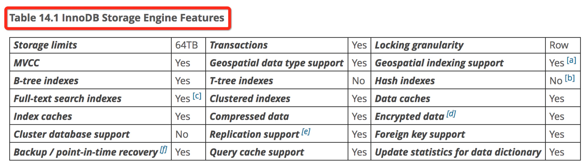
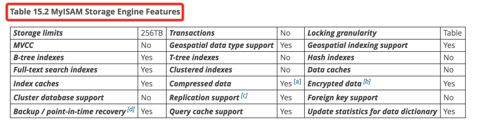
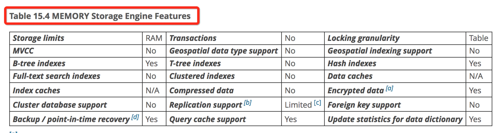
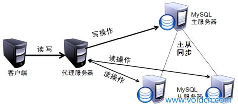
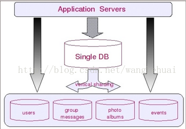
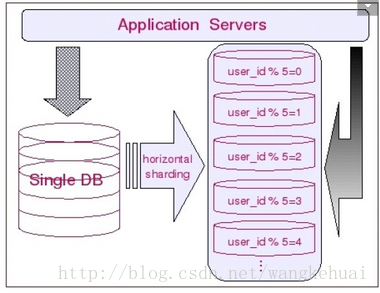
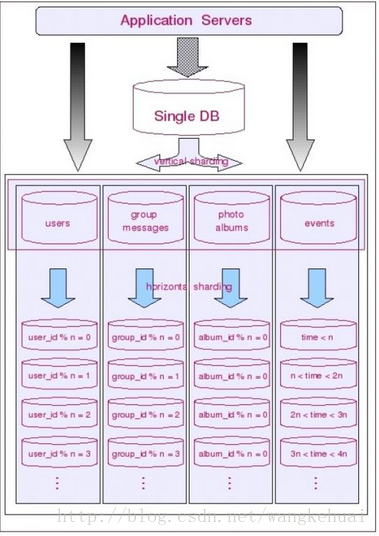

# 数据库

## 使用 mysql 索引都有哪些原则 ?? 索引是什么数据结构 ?? B+tree 和 B tree 什么区别？
索引可分为`聚集索引和非聚集索引`。

先解释一下索引的基本实现原理：
* 聚集索引的叶子结点是数据行，非聚集索引的叶子结点是聚集索引id。聚集索引天然是是唯一索引
* 对`聚集索引进行查询`，可以`快速定位并找到相应的数据行`
* 对非聚集索引进行查询，如果`只需要查询出被索引的字段`，则`不需要重复去查找聚集索引`；如果需要其他字段，则扔需要去查询聚集索引

依照以上的实现原理，可总结的使用原则为：
* 对经常需要作为`唯一 id`，查询出其他数据的列，设为`主键以使用聚集索引`；
* 对经常在 `order by, group by, union, distinct` 中使用的列，可`建立非聚集索引`；
* `避免建立太多索引`，以降低存储和 CUD 的维护成本；
* 如果列太大，可使用前缀建立索引；

索引是什么数据结构？
* B树，二叉搜索树，数据存储在叶子和非叶子结点
* B-树，多叉搜索树，数据存储在叶子和非叶子结点
* B+树，多叉搜索树，`数据存储在叶子结点`

B+ && B- 比 B树 IO 效率要高，一个磁盘块，存储可多路去向，减少整体遍历深度，即 IO 次数少。

## MySQL 有哪些存储引擎啊？都有哪些区别？要详细！

## 设计高并发系统，数据库层面该如何设计？
高并发完成`数据库设计是要结合不同的应用场景的`，

0. 小型网站的应用高并发`采用读写分离基本上就能解决问题`；
1. 字段访问比较均衡，`业务导向明显`，采用`垂直切分`（网上商城，多条业务线）；
2. 字段访问比较均衡，`业务导向不明显`，采用`水平切分`（对单一应用的高并发访问）；
3. `单一字段访问比较集中`（秒杀、大量用户对同一账户操作）；

### 读写分离

### 业务导向明显，垂直切分
将`数据库和服务进行垂直化切分`，通过服务之间的调用来完成业务
这种拆分方式代价：
* `join 操作无法在数据库层面做`
* 单表`大数据量依然存在性能瓶颈`
* `事务保证比较复杂`- 分布式事务
* `应用端的复杂性增加`

### 单表数据量大，业务导向不明显，水平切分
把一个表按照某种规则把数据划分到不同表或数据库里，使得各个数据库中的数据互不关联

水平切分和垂直切分同时使用

### 单点系统

### 对数据库

引用：
* [@B树，B-树，B+树，B*树](http://www.cnblogs.com/oldhorse/archive/2009/11/16/1604009.html)
* [@The Inno DB Strorage Engine](https://dev.mysql.com/doc/refman/5.6/en/innodb-introduction.html)
* [@高并发下的系统设计（偏数据库设计）](http://blog.csdn.net/wangkehuai/article/details/46727203)
