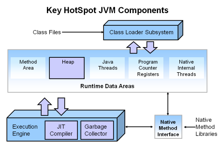
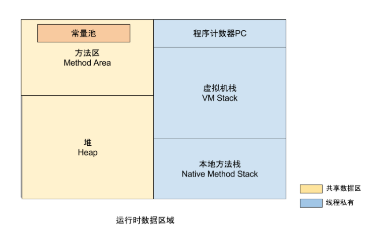
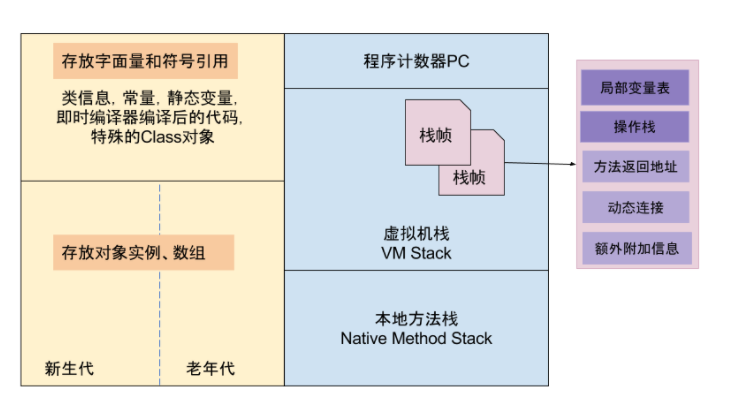
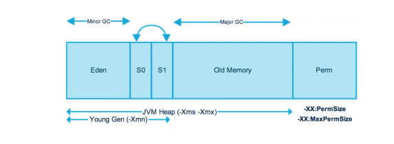
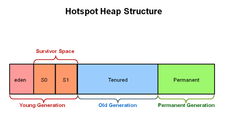
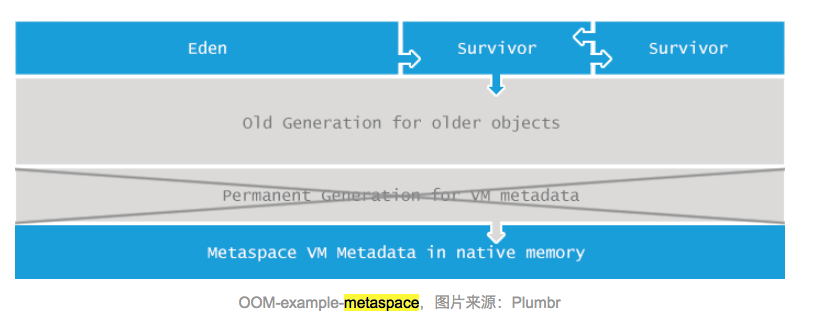

# JVM
## 请介绍一下 JVM 内存模型？用过什么垃圾回收器？都说说呗?

### Hotspot JVM Architecuture

### 理解内存模型

运行时内存模型，分为线程私有和共享数据区两大类，其中线程私有的数据区包含程序计数器、虚拟机栈、本地方法区，所有线程共享的数据区包含Java堆、方法区，在方法区内有一个常量池。

线程私有区：
* `程序计数器`，记录正在执行的虚拟机字节码的地址;
* `虚拟机栈`：方法执行的内存区，每个方法执行时会在虚拟机栈中创建栈帧;
* `本地方法栈`：虚拟机的Native方法执行的内存区;

线程共享区：

* `Java堆`：对象分配内存的区域；
* `方法区`：存放`类信息、常量、静态变量、编译器编译后的代码`等数据；
* `常量池`：存放编译器生成的各种字面量和符号引用，是方法区的一部分

### 详细模型

JVM 运行时内存五大块区域

Java 7 JVM 内存再细分
* 堆被分为2个不同的区域：`新生代（Young）和老年代（Tenured）`
* 新生代被分为：`Eden、From Suvivor、To Survivor`
  * Most of the `newly created objects are located in the Eden memory space`.
  * When Eden space is filled with objects, `Minor GC is performed and all the survivor objects are moved to one of the survivor spaces`.
  * `Minor GC` also checks the survivor objects and move them to the other survivor space. 
  * `Objects that are survived after many cycles of GC, are moved to the Old generation memory space`. 
* 方法区又被叫做 `PermGen`

Java 8 内存模型发生变化

### 用过什么垃圾收集器？（更多的垃圾收集器细节，暂未研究）
* Serial GC - STW 单线程`对新生代进行垃圾收集`
* Parallel GC (Throughput Collector) - STW 多线程，`对新生代进行垃圾收集`
* CMS GC - Concurrent Mark Sweep (CMS) The Concurrent Low Pause Collector，`对旧生代垃圾收集`，由于垃圾收集时候不 STW，可以提高应用响应能力
* G1 GC - 内存布局都和上面不一样，是`未来的垃圾收集器`

引用
* [@G1 and CMS Gabage Collector 详解](http://www.oracle.com/technetwork/tutorials/tutorials-1876574.html)
* [@Java 7 GC Basics[重要]](http://www.oracle.com/webfolder/technetwork/tutorials/obe/java/gc01/index.html)
* [@Java 7 垃圾收集器使用](http://www.fasterj.com/articles/oraclecollectors1.shtml)
* [@Java 垃圾收集器](http://www.cnblogs.com/zhanglei93/p/6636831.html)
* [@JVM 内存模型](http://gityuan.com/2016/01/09/java-memory/)
* [@JVM 异常完全指南](https://www.jianshu.com/p/2fdee831ed03)
* [@Java 7 Memory Model](https://www.journaldev.com/2856/java-jvm-memory-model-memory-management-in-java)

